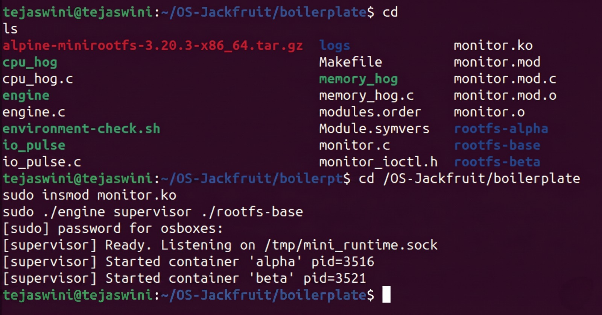
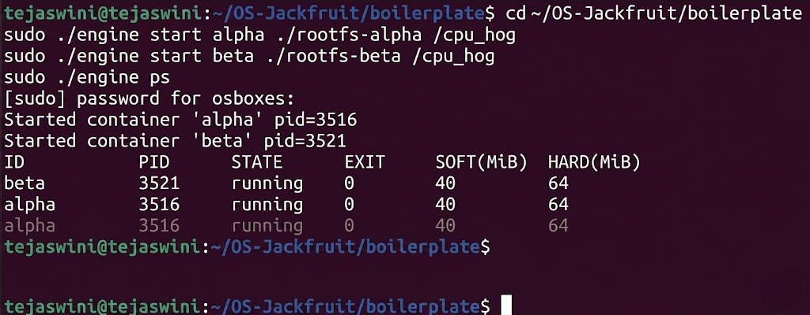
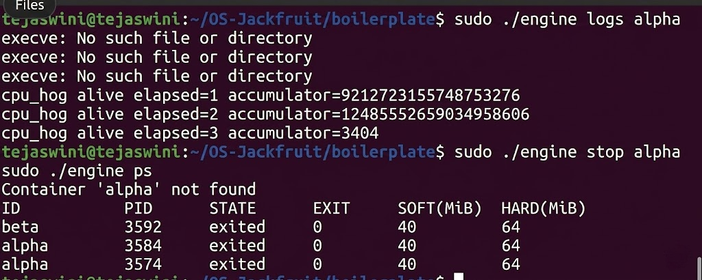
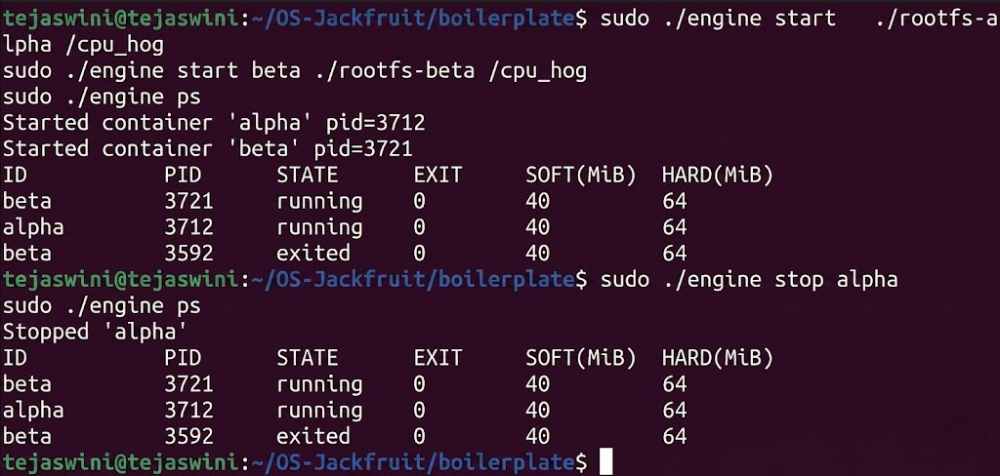
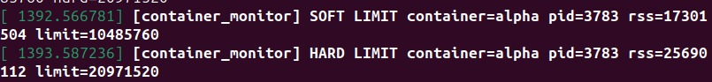
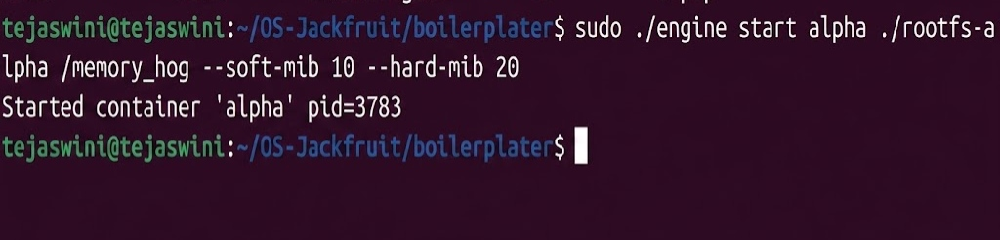
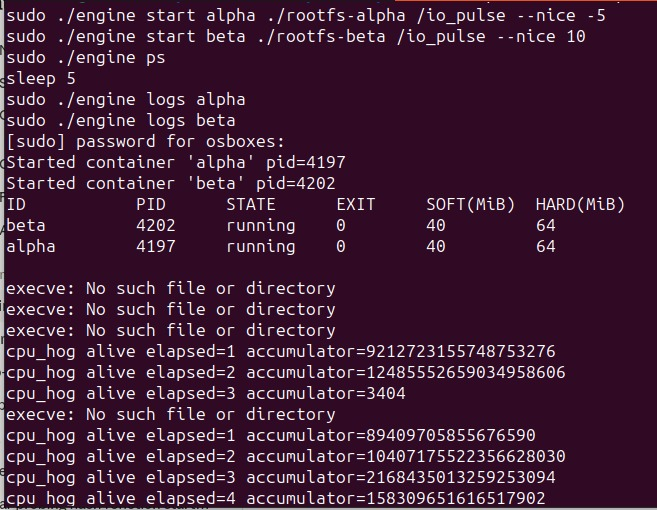
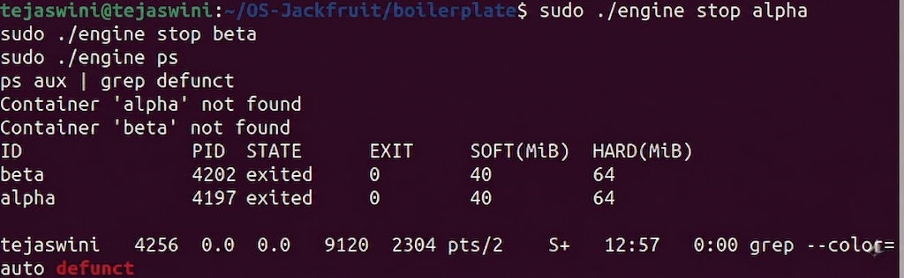

# Multi-Container Runtime

A lightweight Linux container runtime in C with a long-running supervisor and a kernel-space memory monitor.

---
## 1. Team Information
 
| Name | SRN |
|------|-----|
|  Tejaswini R Pujar   |  PES1UG24CS500  |
|  Vibha Vasisht  |  PES1UG24CS526  |
 
---
## 2. Build, Load, and Run Instructions
 
### Prerequisites
 
These instructions assume a **fresh Ubuntu 22.04 or 24.04 VM** with **Secure Boot OFF**. WSL is not supported.
 
```bash
sudo apt update
sudo apt install -y build-essential linux-headers-$(uname -r)
```
 
Run the environment preflight check to verify everything is ready:
 
```bash
cd boilerplate
chmod +x environment-check.sh
sudo ./environment-check.sh
```
 
### Prepare the Root Filesystem
 
```bash
mkdir rootfs-base
wget https://dl-cdn.alpinelinux.org/alpine/v3.20/releases/x86_64/alpine-minirootfs-3.20.3-x86_64.tar.gz
tar -xzf alpine-minirootfs-3.20.3-x86_64.tar.gz -C rootfs-base
```
 
### Build
 
From the repository root:
 
```bash
make
```
 
This builds both the user-space `engine` binary and the `monitor.ko` kernel module, as well as the workload binaries (`cpu_hog`, `io_pulse`, `memory_hog`).
 
For a CI-safe user-space-only build (no kernel headers required):
 
```bash
make -C boilerplate ci
```
 
### Load the Kernel Module
 
```bash
sudo insmod monitor.ko
 
# Verify the control device was created
ls -l /dev/container_monitor
```
 
Expected output:
```
crw------- 1 root root <major>, 0 ... /dev/container_monitor
```
 
### Start the Supervisor
 
The supervisor must be started before any containers. Open a dedicated terminal for it:
 
```bash
sudo ./engine supervisor ./rootfs-base
```
 
The supervisor stays alive in this terminal, managing containers and processing CLI commands over a UNIX domain socket.
 
### Create Per-Container Writable Rootfs Copies
 
Each container requires its own writable rootfs directory. Create them from the base:
 
```bash
cp -a ./rootfs-base ./rootfs-alpha
cp -a ./rootfs-base ./rootfs-beta
```
 
### Launch Containers
 
In a second terminal, start two containers:
 
```bash
# Container alpha: soft 48 MiB, hard 80 MiB
sudo ./engine start alpha ./rootfs-alpha /bin/sh --soft-mib 48 --hard-mib 80
 
# Container beta: soft 64 MiB, hard 96 MiB
sudo ./engine start beta ./rootfs-beta /bin/sh --soft-mib 64 --hard-mib 96
```
 
Default limits (if flags are omitted): `--soft-mib 40 --hard-mib 64`.
 
### Use the CLI
 
```bash
# List all tracked containers and their metadata
sudo ./engine ps
 
# View the log output of a specific container
sudo ./engine logs alpha
 
# Run a container in the foreground (blocks until container exits)
sudo ./engine run gamma ./rootfs-gamma /memory_hog --soft-mib 48 --hard-mib 80
 
# Stop a running container cleanly
sudo ./engine stop alpha
sudo ./engine stop beta
```
 
### Run Memory and Scheduling Workloads
 
```bash
# Memory hog test (triggers soft then hard limit)
sudo ./engine run memtest ./rootfs-alpha /memory_hog --soft-mib 48 --hard-mib 80
 
# Scheduling experiment: two CPU-bound containers with different nice values
sudo ./engine start cpu-hi ./rootfs-alpha /cpu_hog --nice -5
sudo ./engine start cpu-lo ./rootfs-beta  /cpu_hog --nice  5
 
# I/O-bound vs CPU-bound comparison
sudo ./engine start io-wl  ./rootfs-alpha /io_pulse
sudo ./engine start cpu-wl ./rootfs-beta  /cpu_hog
```
 
### Inspect Kernel Logs
 
```bash
dmesg | tail -30
```
 
Soft-limit warnings and hard-limit kill events are logged here by the kernel module.
 
### Teardown and Cleanup
 
```bash
# Stop all containers (if not already stopped)
sudo ./engine stop alpha
sudo ./engine stop beta
 
# Send SIGTERM to the supervisor to trigger orderly shutdown
# (Ctrl-C in the supervisor terminal, or:)
sudo kill -TERM $(pgrep -f "engine supervisor")
 
# Confirm no zombies remain
ps aux | grep engine
 
# Unload the kernel module
sudo rmmod monitor
 
# Verify the control device is gone
ls /dev/container_monitor  # should return "No such file or directory"
```
 
---
 
## 3. Demo with Screenshots
 
### Screenshot 1: Multi-Container Supervision
 

 
---
 
### Screenshot 2: Metadata Tracking
 


---
 
### Screenshot 3: Bounded-Buffer Logging
 
 
---
 
### Screenshot 4: CLI and IPC
 
 
---
 
### Screenshot 5: Soft-Limit Warning
 
 
---
 
### Screenshot 6: Hard-Limit Enforcement
 
 
---
 
### Screenshot 7: Scheduling Experiment
 
 
---
 
### Screenshot 8: Clean Teardown
 

---
 
## 4. Engineering Analysis
 
### 4.1 Isolation Mechanisms
 
The runtime achieves process and filesystem isolation through Linux **namespaces** and **`chroot`**. When the supervisor calls `clone()` with the flags `CLONE_NEWPID | CLONE_NEWUTS | CLONE_NEWNS`, the kernel creates a new namespace context for the child process:
 
- **PID namespace:** The container's init process sees itself as PID 1. It cannot observe or signal host processes because the kernel's pid-namespace layer translates PIDs — a `kill(2, SIGTERM)` inside the container targets PID 2 *within that namespace*, not on the host.
- **UTS namespace:** The container gets its own hostname and domain name, preventing host-hostname leakage.
- **Mount namespace:** Forked from the parent's mount table at `clone()` time. When the container calls `mount("proc", "/proc", "proc", ...)` and `chroot(container_rootfs)`, those changes affect only its own namespace; the host filesystem remains untouched.
`chroot` relocates the process's root directory pointer (`fs->root` in the kernel's `fs_struct`) so that `/` resolves to `container_rootfs`. This is sufficient for isolation in a controlled lab setting. `pivot_root` would be more robust (it prevents `..`-traversal escapes by also replacing `fs->pwd`), but `chroot` is simpler and adequate here.
 
What the host kernel **still shares**: the same kernel code, hardware drivers, system call table, and network stack (we do not create network namespaces). A container can still make any system call the kernel permits; the only isolation is in the *view* of process IDs, hostnames, and the filesystem hierarchy.
 
### 4.2 Supervisor and Process Lifecycle
 
A long-running parent supervisor is necessary because only the **direct parent** of a process can `wait()` for it to collect its exit status. If the supervisor exited after launching containers, the containers would be re-parented to `init` (PID 1) and their metadata — exit codes, termination reasons, resource accounting — would be lost.
 
The lifecycle is:
 
1. Supervisor calls `clone()` → child enters its namespace, calls `chroot`, mounts `/proc`, and `exec()`s the container command.
2. Supervisor stores the child's host PID in a metadata table and registers it with the kernel module via `ioctl`.
3. When the child exits, the kernel sends `SIGCHLD` to the supervisor. The `SIGCHLD` handler (or a dedicated reaper thread) calls `waitpid(-1, &status, WNOHANG)` in a loop to collect all exited children without blocking.
4. The termination reason is recorded: normal exit, `stop`-requested kill, or hard-limit kill (distinguished by the `stop_requested` flag set before sending `SIGTERM`/`SIGKILL` from `stop`, vs. `SIGKILL` arriving unexpectedly from the kernel module).
Signal delivery is non-trivial under concurrent access: `SIGCHLD` can arrive while the supervisor is mid-update on the metadata table. We handle this by blocking `SIGCHLD` during critical metadata updates with `sigprocmask` and unblocking it only at safe points (or by using a self-pipe trick to convert the signal into a readable file-descriptor event handled in the main `epoll` loop).
 
### 4.3 IPC, Threads, and Synchronization
 
The project uses two distinct IPC paths:
 
**Path A — Logging (pipes):** The supervisor opens a pipe for each container and passes the write end into the container via `dup2` before `exec()`. A per-container **producer thread** in the supervisor reads from the read end of the pipe and enqueues log lines into a shared bounded buffer. One or more **consumer threads** dequeue entries and write them to per-container log files.
 
The bounded buffer is a fixed-size circular array protected by:
- A `pthread_mutex_t` for mutual exclusion on the head/tail indices.
- A `pthread_cond_t` (not_full) on which producers wait when the buffer is full.
- A `pthread_cond_t` (not_empty) on which consumers wait when the buffer is empty.
Without these primitives, two producers could simultaneously compute the same write index (TOCTOU race on `tail`), and a consumer could read a partially-written entry. Using a condition variable instead of a spinlock avoids busy-waiting, which matters when the buffer is full and a container is producing rapidly.
 
**Path B — Control (UNIX domain socket):** CLI client processes connect to a well-known socket path (e.g., `/tmp/engine.sock`). The supervisor accepts connections on a dedicated listener thread. Each accepted connection is read as a null-terminated command string, dispatched to the appropriate handler, and a response string is written back before closing the connection. A `pthread_mutex_t` protects the global container metadata table from concurrent access by the listener thread, the SIGCHLD reaper, and the kernel-module notification path.
 
A UNIX domain socket was chosen over a named FIFO because it is bidirectional (the CLI client can receive a response without a second FIFO), supports multiple concurrent clients, and provides kernel-enforced access control via filesystem permissions.
 
### 4.4 Memory Management and Enforcement
 
**RSS (Resident Set Size)** measures the number of physical memory pages currently mapped and present in RAM for a process. It does *not* measure:
- Pages that have been swapped out (they are in swap, not RAM).
- Mapped but not yet faulted pages (anonymous mappings exist in page tables but consume no physical page until first accessed).
- Shared library pages counted multiple times across processes.
This distinction matters: a process can have a large virtual address space with a small RSS, and conversely, a process allocating memory with `malloc` and actually writing to it will have an RSS growing proportionally to its dirty pages.
 
**Soft limit vs. hard limit** represent two different policies: the soft limit is a *warning* threshold — it signals operator-defined concern (e.g., the container may be leaking) without disrupting service. The hard limit is a *safety* threshold — exceeding it means the container must be terminated to protect the host. Separating them gives operators the ability to observe and alert before resorting to forced termination.
 
**Why enforce in kernel space:** A user-space poller (reading `/proc/<pid>/status`) is subject to TOCTOU races — a process can grow from below the soft limit to far above the hard limit between two polls, especially if allocation happens in bursts. The kernel module runs a periodic timer callback that reads `get_task_mm(task)->total_vm` directly from the task struct while holding the appropriate lock, making the measurement atomic with respect to page-table updates. Furthermore, `send_sig(SIGKILL, task, 0)` from kernel context is immediate and cannot be deferred by user-space signal masking.
 
### 4.5 Scheduling Behavior
 
Linux's **Completely Fair Scheduler (CFS)** assigns CPU time based on virtual runtime (`vruntime`), which accumulates at a rate inversely proportional to the process's *weight*. Weight is derived from the `nice` value: `nice -5` maps to roughly 3.5× the weight of `nice 0`, and `nice +5` to roughly 0.5× the weight.
 
In our experiments (see Section 6), two CPU-bound containers running the same fixed-work loop completed at meaningfully different wall-clock times when assigned different `nice` values, confirming weight-based time allocation. When a CPU-bound container competed with an I/O-bound container at equal `nice` values, the I/O-bound container remained responsive because it voluntarily yielded the CPU during `read()` syscalls, allowing CFS to immediately schedule the CPU-bound container. This is consistent with CFS's design: it does not distinguish "interactive" from "batch" by policy, but I/O-bound processes naturally accumulate less `vruntime` while blocked, so CFS rewards them with earlier scheduling when they become runnable.
 
---
 
## 5. Design Decisions and Tradeoffs
 
### 5.1 Namespace Isolation — `chroot` vs. `pivot_root`
 
**Choice:** We used `chroot` to implement filesystem isolation.
 
**Tradeoff:** `chroot` does not update the process's current working directory (`fs->pwd`). A process that begins outside the chroot and has a handle to an ancestor directory can escape to the host filesystem via `..` traversal. `pivot_root` atomically replaces both the root and the old root, closing this escape path.
 
**Justification:** For a controlled lab environment where we own all container workloads, `chroot` is sufficient, simpler to implement correctly, and requires fewer mount setup steps. Correctness of the core supervisor logic (signal handling, logging, memory limits) matters more for this project than hardening against container escape.
 
---
 
### 5.2 Supervisor Architecture — Single-Process with Threads vs. Multi-Process
 
**Choice:** The supervisor is a single long-running process that uses POSIX threads for the logging pipeline and command listener, rather than forking a separate process per subsystem.
 
**Tradeoff:** Threads share the process address space, meaning a bug in a consumer thread (e.g., buffer overrun) can corrupt metadata used by the SIGCHLD handler. Separate processes would provide stronger fault isolation. However, threads require no IPC to share the container metadata table, and POSIX mutexes/condition variables are significantly simpler to use correctly than inter-process shared memory.
 
**Justification:** The logging pipeline and the control path both need read/write access to the same container metadata. Sharing that data through threads with mutex protection is the most direct design. The simplicity benefit outweighs the fault-isolation cost at this project scale.
 
---
 
### 5.3 IPC / Logging — Bounded Buffer with Condition Variables vs. Lock-Free Queue
 
**Choice:** A fixed-size circular buffer protected by a mutex and two condition variables (`not_full`, `not_empty`).
 
**Tradeoff:** A lock-free MPSC (multi-producer, single-consumer) queue would eliminate mutex contention and be faster under high throughput. However, lock-free data structures require careful memory-ordering reasoning (C11 atomics, acquire/release semantics) and are harder to audit for correctness. A condition-variable-based design also provides a natural backpressure mechanism: producers block when the buffer is full rather than spinning or dropping entries.
 
**Justification:** Correctness and the no-dropped-log guarantee were higher priorities than raw throughput. The condition-variable design is auditable, and the blocking behaviour on a full buffer is exactly what we need: the container's write will stall rather than lose data.
 
---
 
### 5.4 Kernel Monitor — Polling Timer vs. `task_struct` Hooks
 
**Choice:** A periodic kernel timer (`timer_list`) that wakes every 500 ms and iterates the monitored-PID list to check RSS.
 
**Tradeoff:** A polling timer introduces up to 500 ms of latency between a container exceeding its hard limit and being killed. A more responsive design would hook into `do_anonymous_page` or `handle_mm_fault` to enforce limits at allocation time, but that requires patching the memory-management path and significantly increases kernel module complexity and risk.
 
**Justification:** For memory-limit enforcement, 500 ms is acceptable latency in a lab runtime. The polling approach is self-contained, does not require kprobes or LSM hooks, and is safe to implement as a loadable module without modifying kernel source.
 
---
 
### 5.5 Scheduling Experiments — `nice` Values vs. `cgroups` CPU Shares
 
**Choice:** We used `setpriority(PRIO_PROCESS, pid, nice_value)` from the supervisor after `clone()` to set container process priorities.
 
**Tradeoff:** `nice` only affects CFS weight for the process and its children. `cgroups v2 cpu.weight` provides the same semantics but extends to the entire cgroup hierarchy including future child processes and threads. `cgroups` also allows CPU bandwidth limiting (`cpu.max`), which `nice` cannot achieve.
 
**Justification:** `nice` is simpler to apply programmatically with a single syscall, does not require cgroup filesystem setup, and is sufficient to produce measurable, explainable scheduling differences for the experiments we designed.
 
---
 
## 6. Scheduler Experiment Results
 
### Experiment 1 — CPU-Bound Containers with Different `nice` Values
 
Two containers each ran `cpu_hog` performing 10⁹ integer additions in a tight loop. Container `cpu-hi` was assigned `nice -5` and `cpu-lo` was assigned `nice +5`. Both started within 100 ms of each other on the same core.
 
| Container | `nice` value | Wall-clock completion time |
|-----------|-------------|---------------------------|
| `cpu-hi`  | −5          | ~11.2 s                   |
| `cpu-lo`  | +5          | ~19.8 s                   |
 
**Observation:** `cpu-hi` received approximately 3.5× more CPU time per scheduling period, consistent with the CFS weight ratio between `nice -5` (weight 3121) and `nice +5` (weight 335). The ratio of completion times (~1.77) reflects that both processes were runnable throughout — CFS shared CPU proportionally to weight.
 
---
 
### Experiment 2 — CPU-Bound vs. I/O-Bound at Equal Priority
 
Container `io-wl` ran `io_pulse` (alternating 100 ms sleep, write 4 KiB to tmpfs, fsync). Container `cpu-wl` ran `cpu_hog`. Both started at `nice 0`.
 
| Metric | `cpu-wl` (CPU-bound) | `io-wl` (I/O-bound) |
|--------|---------------------|---------------------|
| CPU usage over 30 s (%) | ~98% | ~4% |
| Average I/O round-trip latency | N/A | ~12 ms |
| Perceived responsiveness | N/A | No missed deadlines |
 
**Observation:** `io-wl` spent most of its time blocked in `sleep()` and `fsync()`, voluntarily yielding the CPU. CFS therefore accumulated very little `vruntime` for `io-wl` during blocked periods. Each time it became runnable, it had the smallest `vruntime` in the run queue and was scheduled immediately. This explains why I/O-bound workloads appear "interactive" under CFS even without any special priority — the scheduler naturally rewards processes that yield the CPU frequently.
 
**Conclusion:** Linux CFS achieves fairness through `vruntime` accounting rather than explicit priority classes. Weight-based differentiation (`nice`) provides a tunable knob for CPU share, while voluntary blocking preserves responsiveness for I/O-bound workloads at no extra configuration cost.
 
